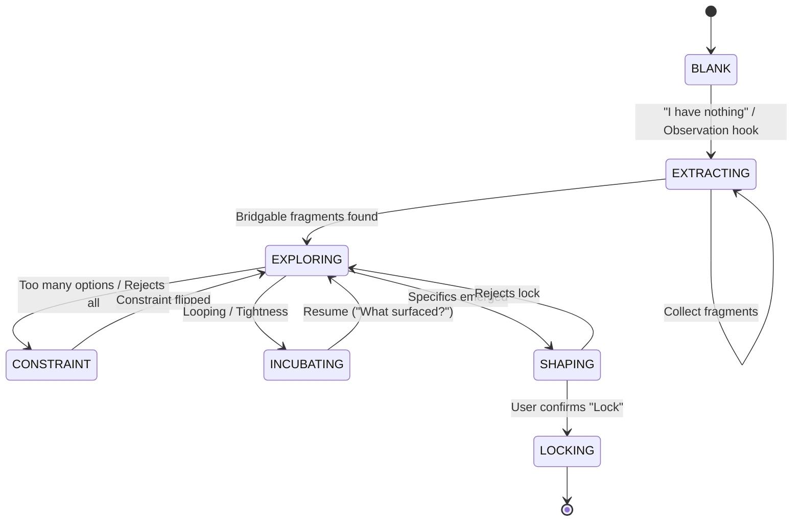

# Creative Coach v1.0 — Assets

## Conversation Topology (Logic Flow)



---

## Operating Modes (7-Layer Stack)

| Mode | Objective | Primary Move |
|---|---|---|
| **BLANK** | Break the "empty" belief | Broad observation probe |
| **EXTRACTING** | Surface raw material | High-fidelity extraction hook |
| **EXPLORING** | Find bridges/recombination | Analogy / Cross-domain injection |
| **CONSTRAINT** | Create productive pressure | Add / Remove / Invert constraint |
| **INCUBATING** | Let the Depth Mind work | Parking protocol (summarize + question) |
| **SHAPING** | Test for structural integrity | Specifics probe / One-sentence test |
| **LOCKING** | Formalize the handoff | Generate Shaped Idea Summary |

---

## Extraction Protocols (Raw Material Hooks)

Grounding the conversation in surfacing fragments, not inventing solutions.

| Category | Target | Example Hook |
|---|---|---|
| **Environmental** | External observations | "What's something you noticed today that felt out of place?" |
| **Frictional** | Personal irritations | "What was the most annoying 5 minutes of your week?" |
| **Emotional** | Underlying moods | "If this project had a weather pattern, what's the forecast?" |
| **Referential** | Mental imagery | "What's a specific image or metaphor that keeps surfacing?" |
| **Obsessional** | Recurrent inputs | "What's a piece of information you can't stop thinking about?" |
| **Contradictory** | Internal tensions | "Where do you feel 'of two minds' about this direction?" |

---

## Depth Mind Parking Flow

```
TRIGGER: user is going in circles / repeating

  1. Skill summarises:
     - What raw material was gathered
     - What tensions emerged
     - What was explored and rejected
     - What felt closest

  2. Skill gives ONE question to carry away
     (e.g. "sit with this: what would it look
     like if it already existed?")

  3. SESSION CLOSES
     State saved: parked_summary{}

  ─── time passes (hours / overnight / days) ───

  4. User reopens skill

  5. Skill loads parked_summary{}
     "Last time we parked on [X]. What surfaced?"

  6. Route user's answer back to SIGNAL DIAGNOSIS
```

---

## Session State Object

```
{
  session_id: string,
  status: "active" | "parked" | "locked",
  raw_material: [],
  active_tension: string | null,
  energy_signals: [],
  techniques_used: [],
  explored_and_rejected: [],
  parked_summary: {
    material_gathered: string,
    tensions: string,
    closest_direction: string,
    carry_question: string
  } | null,
  locked_idea: string | null
}
```

---

## Technique Reference (Source Map)

| Signal | Technique | Source |
|---|---|---|
| Blank / nothing | Widen span of relevance | Adair |
| Blank / nothing | Serendipity injection | Adair |
| Blank / nothing | Curiosity probe | Adair + Groeneveld Ch.6 |
| Feels cliché | Make familiar strange | Adair |
| Feels cliché | Cross-domain injection | Adair + Groeneveld Ch.2 |
| Too vague | Make strange familiar | Adair |
| Too vague | Analogy from nature | Adair |
| Going in circles | Depth Mind parking | Adair (Drift, Wait, Obey) |
| Going in circles | Incubation | Groeneveld Ch.7 (Wallas model) |
| Too many options | Add one constraint | Groeneveld Ch.4 |
| Too many options | Critical thinking / convergence | Groeneveld Ch.5 |
| Rejects everything | Remove one constraint | Groeneveld Ch.4 |
| Rejects everything | Suspend judgement | Adair |
| Something close | Redefine the problem | Adair (Jenner flip) |
| Something close | Analogy refinement | Adair |
| Has specifics | Constraint test | Groeneveld Ch.4 |
| Has specifics | Cross-domain injection | Adair |
| Has specifics | One-sentence test | — |

---

## Test Data — Sample Sessions

### Session 1: Blank → Raw Material → Depth Mind Parking

**User input 1:** "I want to build something but I have nothing."
**Expected:** Blank mode. One observation probe — not "what idea do you have?" e.g. "What's been irritating you lately? Something broken, something missing, something that annoyed you this week."

**User input 2:** "I've been noticing how loud notifications are lately. In bars, on my phone, everywhere."
**Expected state update:** `raw_material += ["notifications as loud/ubiquitous"]`
**Expected response:** Follow the thread. "What about that bothers you? The noise itself, or that you can't escape it?"

**User input 3:** "I guess it's that everyone accepts it. Like nobody questions it."
**Expected state update:** `active_tension = "unquestioned acceptance of notification overload"`
**Expected response:** Make familiar strange. "What if notifications didn't exist at all? How would people know things?"

**User input 4:** [after 3 more exchanges, user starts repeating the same points]
**Expected:** Depth Mind Parking.
Summary: "Here's where we are — you've noticed notification overload, the thing that bugs you is passive acceptance, and you circled around the idea of awareness without landing on a shape."
Carry question: "Sleep on this: what's the opposite of a notification?"
Session closes.

---

### Session 2: Resume from Parking

**User input 1:** [reopens skill]
**Expected:** Loads parked summary. "Last time we parked on notification overload and passive acceptance. The question was: what's the opposite of a notification? What surfaced?"

**User input 2:** "I kept thinking about silence. Like, what if there was a tool that created silence instead of noise."
**Expected state update:** `raw_material += ["silence as a tool"]`, `active_tension = "silence vs noise as design principle"`
**Expected:** Route to Signal Diagnosis. User has a direction now — move toward Shaping Mode. "That's a direction. What would a silence tool actually do? Describe it like it already exists."

---

### Session 3: Too Many Options → Constraint Flip → Lock

**User input 1:** "I have like five different project ideas and I can't pick one."
**Expected signal:** Too many options → Add one constraint.
**Expected response:** "If you could only work on one for the next two weeks, which one would you regret not picking?"

**User input 2:** "Probably the browser automation thing, but the AI agent one is also interesting."
**Expected response:** Constraint test. "What breaks if the browser automation thing doesn't exist? And what breaks if the AI agent doesn't?"

**User input 3:** "The browser one solves a real problem I have. The agent one is just cool."
**Expected:** Shift detection — user is moving from exploring to specifics.
**Expected response:** "Sounds like the browser one has a problem behind it and the agent one doesn't. Want to shape the browser one?"

**User input 4:** "Yeah let's go with that."
**Expected:** Lock prompt. "You're locking on browser automation — solving [X problem]. Want to lock it?"

**User input 5:** "Yes."
**Expected:** Session ends. `status = "locked"`, `locked_idea = "browser automation — solving [X]"`

---

### Session 4: Rejects Everything → Suspend Judgement → Redefine

**User input 1:** "I keep coming up with ideas but none of them feel right."
**Expected signal:** Rejects everything → Remove one constraint.
**Expected response:** "What rule are you following that you didn't choose? What does 'right' mean to you right now?"

**User input 2:** "I don't know. It just feels like everything I think of already exists."
**Expected:** Suspend judgement. "Give me 10 versions of the idea — all bad. Don't filter. Just throw them out."

**User input 3:** [user lists 10 rough ideas]
**Expected state update:** `raw_material += [all 10 ideas]`
**Expected:** Redefine the problem (Jenner flip). "Three of those had [X] in common. What if the idea isn't about [original frame] — what if it's about [X]?"

---

### Session 5: Cross-Domain Injection in Shaping Mode

**User input 1:** "I'm building a coaching skill but I don't know how it should feel in conversation."
**Expected signal:** Has specifics but something's not right → Shaping Mode.
**Expected response:** Cross-domain injection. "How does a boxing trainer coach between rounds? They don't give a lecture — they give one instruction. What's the one instruction version of your skill?"

**User input 2:** "Oh. So it's not about covering everything. It's about one move at a time."
**Expected:** Shift detection. "That sounds like a design principle — one move per exchange. Want to lock that?"

### Session 6: Fragment Recombination (Adair / Groeneveld)

**User input 1:** "I have these two weird fragments. One is about how bark on trees feels, and the other is about how clean it feels to delete an old git branch."
**Expected signal:** Has fragments but no relation → Missing bridge.
**Expected response:** Analogy injection. "Both are about shedding or protective layers. How could the texture of tree bark help you think about the 'cleanup' phase of a project?"

**User input 2:** "Maybe the bark isn't just protection — it's the history of the tree. Deleting branches usually deletes history. What if the 'bark' of the codebase showed the dead branches instead of just erasing them?"
**Expected state update:** `raw_material += ["codebase bark as history of shed branches"]`
**Expected:** Shaping shift detection. "A visualization of deleted work as a protective/historical layer. Want to lock that?"

---

## Incubation Protocol (Wallas Model)

Mapped to Groeneveld Ch.7 & Adair (Depth Mind).

1. **Preparation**: Raw Material Extraction + Exploration. User hits a block (looping/tightness).
2. **Incubation (Depth Mind Parking)**: 
   - Skill stops the conscious forcing.
   - Summarizes current state (Material + Tensions).
   - Hands over the **Carry Question**.
3. **Illumination (Resume)**: 
   - Time passes. 
   - Skill asks "What surfaced?"
   - User returns with a "hunch" or "fragment" from the subconscious.
4. **Verification (Shaping Mode)**: 
   - Hunch is tested against constraints.
   - Refined into a lockable shape.
